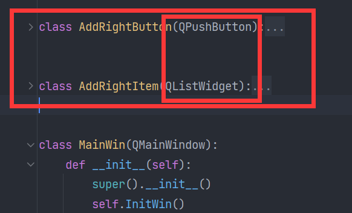
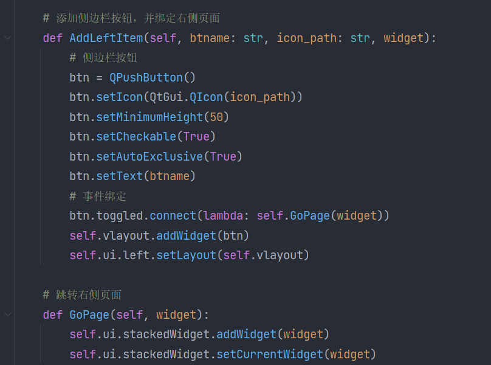
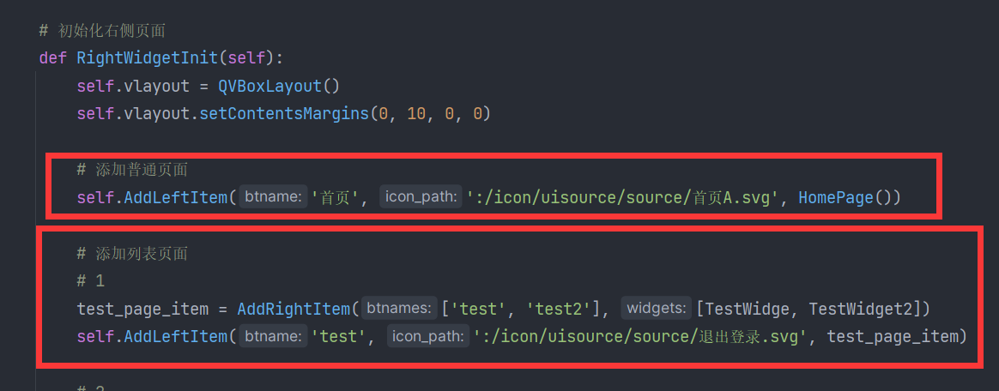

# QtFastListUI
It can creat a concise Qlistwidget interface, Including the sidebar

# 介绍/Introduction
**感谢浏览本项目**  
* 该项目是基于pyqt5，通过重写QListWidgets,QPushButton类，实现快捷创建一个简洁的折叠窗口
* 其中包括简洁美观的侧边栏，让你更快的把很多可以折叠起来的窗口整合到一个页面上，并把这个页面
绑定到左侧的侧边栏上
* 欢迎大家使用本项目整合制作一些工具
  

# 效果演示
* 主程序为MainWindow.py，其中使用了qt designer制作了简单的基础界面，ui文件为Mainui.ui，并通过qtuic转换为同名的py文件
### 1. 重写的QListWidgets,QPushButton类
  

### 2. 创建侧边栏，并绑定创建好的页面
  

### 3. 通过调用重写的QListWidget类，和上面的函数，将创建好的页面（这里使用[widget.py](./widgets)文件里面创建好的TestWidget窗口做演示）
* 注意创建普通窗口和list窗口的用法!，普通窗口的创建以[widget.py](./widgets)文件里面创建好的HomePage窗口做演示

### 4. 
